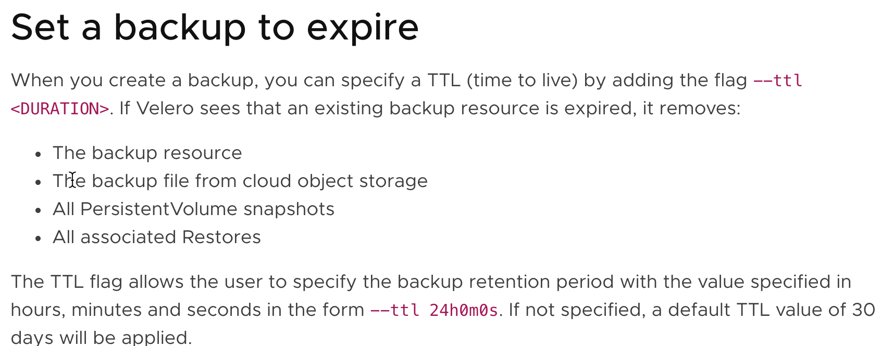

#### Velero Introduction ####

Velero is an open source tool that helps backup and restore Kubernetes resources. It also helps with migrating Kubernetes resources from one cluster to another. Also, it can help backup/restore data in persistent volumes

## Backup Hook Feature ##
you can specify one or more commands to execute in a container in a pod, when a pod is being backed up. Can be used in scenarios like freeze the file system to ensure that all pending disk I/O operations have completed prior to taking a snapshot

References:
- https://velero.io/docs/v1.5/
- https://velero.io/docs/v1.5/supported-providers/
